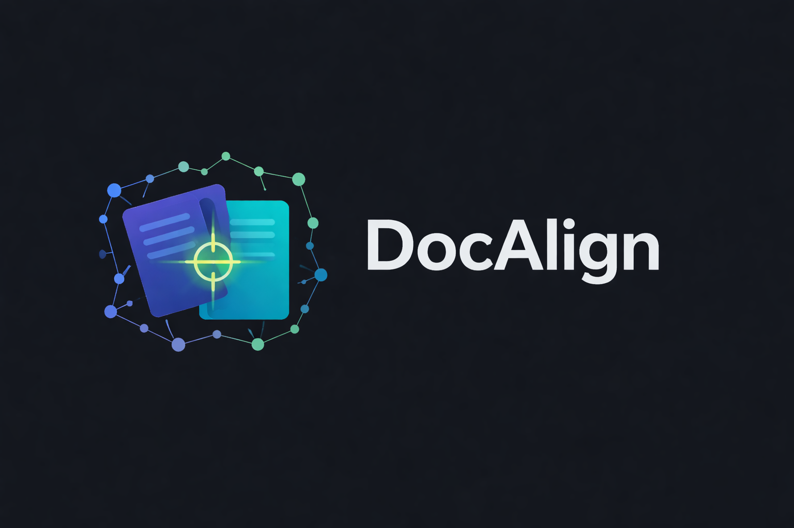

# 🔍 DocAlign - Where docs meet code reality.

<p align="center">
  <br><br>
  
</p>

[](https://www.npmjs.com/package/docalign)
[](LICENSE)
[](tsconfig.json)

Detects when your documentation drifts from code reality — and tells your AI coding agent about it.

## Overview

Most documentation checkers verify syntax: does this file exist, is this version correct? DocAlign goes further. It reads your docs the way a developer would, extracts every factual claim — both mechanical facts *and* behavioral assertions — and verifies each one against the actual codebase.

The result is a living map of what your docs claim vs. what your code does, kept current on every commit. Works as an **MCP server** for Claude Code (primary) or as a standalone **CLI**.

## How It Works

**On first setup**, a sub-agent reads each selected doc in parallel, extracts every verifiable behavioral claim, and stores it with a stable ID:

- *"Requests are authenticated using JWT tokens validated in `middleware/auth.ts`"*
- *"The worker retries failed jobs up to 3 times with exponential backoff"*
- *"All errors are forwarded to Sentry before responding to the client"*

These are the claims that go stale — and that no regex can catch.

**On every commit**, a Claude Code **PostToolUse hook** fires when Claude runs `git commit`. It reads which source files changed and tells Claude to invoke the `/docalign` skill. The skill then reverse-looks up which stored claims reference those files, re-verifies only those claims against the updated code, and reports any mismatches.

Change `src/auth.ts` and only auth-related docs are re-checked — not your entire doc tree. Extraction runs once; verification runs on every commit, scoped to what changed.

## What It Finds

**Syntactic checks** (regex-based, instant):

| Category | Example |
|----------|---------|
| File paths | `src/auth.ts` referenced but doesn't exist |
| Dependencies | README says `express 4.17`, package.json has `4.18` |
| CLI commands | `npm run deploy` but no `deploy` script defined |
| API routes | `GET /api/users` not found in route handlers |
| Code examples | Import from `./utils/helpers` but symbol not exported |
| Env variables | `DATABASE_URL` documented but missing from `.env.example` |
| Config values | "Defaults to port 3000" but code uses 8080 |

**Semantic checks** (LLM-powered, via Claude):

Behavioral claims that regex can't verify — extracted from prose, stored as structured claims with stable IDs, re-checked against source on every scan. Every claim falls into one of three types:

| Type | Example claim | Would drift when… |
|------|---------------|-------------------|
| `behavior` | *"Uses JWT for authentication"* | Auth switches to sessions or middleware is removed |
| `behavior` | *"Retries failed jobs up to 3 times"* | Retry count changes or retry logic is deleted |
| `behavior` | *"Returns 404 for unknown routes"* | Error handling is restructured |
| `architecture` | *"Processes files in parallel using worker threads"* | Parallelism replaced with sequential execution |
| `architecture` | *"Claims are extracted once and cached per section"* | Caching removed or extraction always re-runs |
| `config` | *"Defaults to port 3000"* | The port constant is updated in source |
| `config` | *"Timeout defaults to 30 seconds"* | The timeout value is changed |

Semantic claims are extracted once per document, assigned stable IDs, cached alongside the doc, and re-verified automatically whenever related code changes.

See [Checks Reference](docs/reference/checks.md) for all claim types.

## Setup

Run this from the root of your project:

```bash
cd your_project_root
curl -fsSL https://raw.githubusercontent.com/BigDanTheOne/docalign/main/scripts/install.sh | bash
```

The script checks prerequisites (Node 18+, git), installs DocAlign globally, runs `docalign init` to configure the MCP server and skills, then launches Claude Code. Claude walks you through selecting which docs to monitor and runs the initial extraction — one sub-agent per document, in parallel.

After setup, Claude automatically checks documentation after code changes and answers "are my docs accurate?" directly. No further configuration required.

## Claude Code Skill

DocAlign ships as a native **Claude Code skill** — an agent workflow that Claude runs automatically, not a tool you have to remember to call.

Once installed, Claude watches every `git commit`. When source files change, the skill:

1. Looks up which docs reference those files
2. Re-verifies each affected doc's claims against the updated code
3. Surfaces any mismatches inline, with the exact line and a suggested fix

The result: **stale documentation gets caught at commit time**, before it reaches reviewers or other developers. No CI step required, no separate lint job — it runs inside the same Claude Code session where you're already working.

You can also invoke it on demand:

- `/docalign` — check docs affected by recent changes
- `/docalign-setup` — first-time interactive setup wizard

## MCP Tools

Claude Code gets 4 documentation tools:

| Tool | What it does |
|------|-------------|
| `check_doc` | Check a doc file for drift — optionally scoped to a section (`section=`) or with full audit (`deep=true`) |
| `scan_docs` | Repo-wide health score + ordered drift hotspot list |
| `get_docs` | Search docs by topic or reverse-lookup docs that reference a code file (`code_file=`) |
| `register_claims` | Persist semantic claims found during analysis |

See [MCP Tools Reference](docs/reference/mcp-tools.md) for parameters and return values.

## CLI

For one-off checks, CI use, or manual setup:

```bash
npx docalign init              # Manual setup (alternative to install.sh)
npx docalign scan              # Scan entire repository
npx docalign check README.md   # Check a single file
```

See [CLI Reference](docs/reference/cli.md) for all commands and flags.

## Configuration

Works with zero configuration. To customize, create `.docalign.yml`:

```yaml
doc_patterns:
  include: ['README.md', 'docs/**/*.md']
  exclude: ['docs/archive/**']

claim_types:
  url_reference: false   # Skip dead link checks

verification:
  min_severity: medium   # Only report medium+ issues
```

See [Configuration Reference](docs/reference/configuration.md) for all options.

## Documentation

**Getting started:** [Installation & first scan](docs/getting-started.md)

**Guides:** [Checking files](docs/guides/checking-files.md) · [Semantic extraction](docs/guides/semantic-extraction.md) · [MCP integration](docs/guides/mcp-integration.md) · [Fixing drift](docs/guides/fixing-drift.md) · [Suppressing findings](docs/guides/suppressing-findings.md) · [Custom configuration](docs/guides/custom-configuration.md)

**Reference:** [CLI](docs/reference/cli.md) · [Configuration](docs/reference/configuration.md) · [Checks](docs/reference/checks.md) · [MCP tools](docs/reference/mcp-tools.md)

**Explanation:** [How it works](docs/explanation/how-it-works.md) · [Verification tiers](docs/explanation/verification-tiers.md)

**Contributing:** [Architecture](docs/contributing/architecture.md) · [Design patterns](docs/contributing/design-patterns.md) · [Adding a check](docs/contributing/adding-a-check.md) · [Testing](docs/contributing/testing.md)

[Troubleshooting](docs/troubleshooting.md)

## License

MIT
